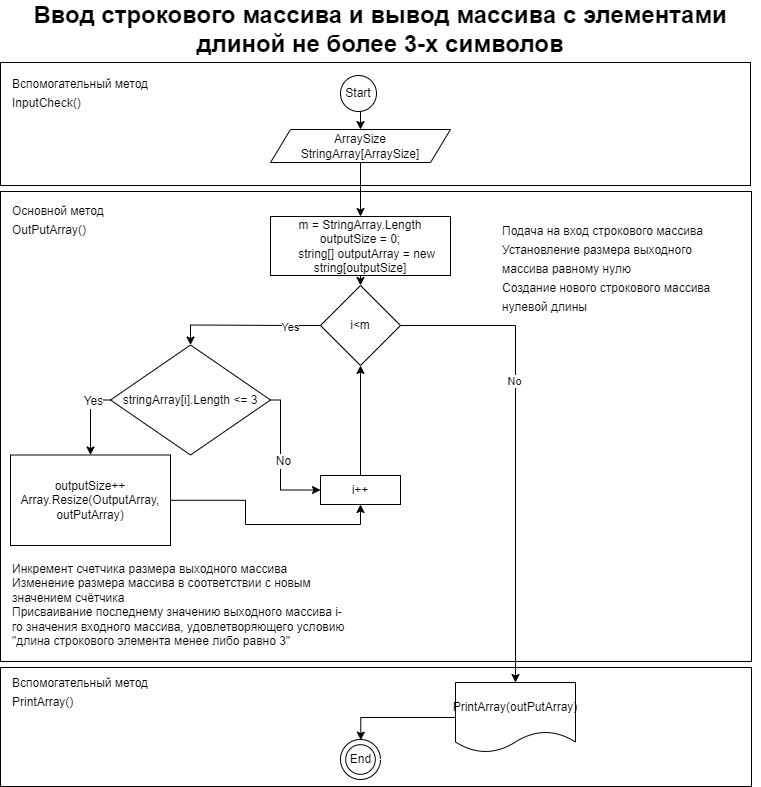

# Описание задачи
Задача: Написать программу, которая из имеющегося массива строк формирует массив из строк, длина которых меньше либо равна 3 символа. Первоначальный массив можно ввести с клавиатуры, либо задать на старте выполнения алгоритма. При решении не рекомендуется пользоваться коллекциями, лучше обойтись исключительно массивами.
## Описание алгоритма
Программа выполнена на языке C#, решение задачи состоит из основного метода OutPutArray(), принимающего на вход строковый массив произвольной длины и выдающего массив содержащий только строковые элементы длиной 3 и менее символов. Кроме того, созданы два вспомогательных метода для заполнения строкового массива InputCheck() и печати произвольного одномерного строкового массива PrintArray().

Общий алгоритм приведен на рисунке ниже:

Основные этапы выполнения программы:
- вызов вспомогательного метода InputCheck(), ввод одномерного строкового массива
- подача на вход основного метода OutPutArray() одномерного строкового массива, полученного в результате исполнения вспомогательного метода InputCheck()
- вывод на печать исходного и преобразованного массивов с использованием вспомогательного метода PrintArray()

Выполнение основого метода начинается с подачи на вход строкового массива, установления размера выходного массива равному нулю и создания нового строкового массива нулевой длины.

Основное тело метода - цикл со счетчиком i с максимальным значением равным размеру входного массива и вложенной проверкой на длину строки каждого строкового элемента входного массива (менее или равно 3-м). В случае, если длина строки очередного элемента входного массива соответствует установленному критерию, выполняется следующая последовательность:
- Инкремент счетчика размера выходного массива
- Изменение размера выходного массива в соответствии с новым значением счётчика
- Присваивание последнему значению выходного массива i-го значения входного массива 
- удовлетворяющего условию "длина строкового элемента менее либо равно 3"

После выполнения основного метода, при помощи вспомогательного PrintArray() в консоль выводятся входной и выходной массивы. Пример работы программы:
    
    Введите количество строк массива: : 5
    элемент  0: 123
    элемент  1: 546
    элемент  2: 23
    элемент  3: dfsggfsdg
    элемент  4: 465
    123 546 23 dfsggfsdg 465 
    123 546 23 465
    